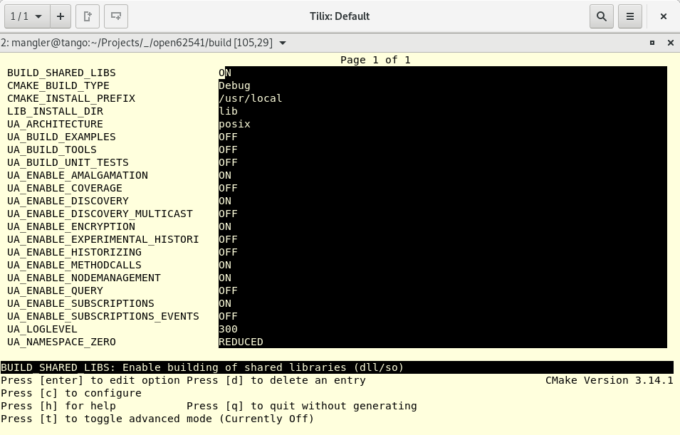

# OPC-UA Ruby Bindings (open62541)

The development of OPC UA applications takes currently a lot of effort. This is caused by the large possibilities of the OPC UA specification. With this implemtation we want to define some conventions, which shoud make the technology more useable.

## Table of Contents

1. [Modelling Style](#Modelling-Style)
2. [Installation](#Installation)
3. [Examples](#Examples)
    1. [Server](#Server)
        1. [Create Server and Namespace](#Create-Server-and-Namespace)
        2. [Create ObjectTypes](#Create-ObjectTypes)
            1.[Add Variable](#add-variable)
            2.[Add Object](#add-object)
            3.[Add Method](#add-method)
        3. [Manifest Objects](#Manifest-Objects)
        4. [Find Nodes in the Addressspace](#Find-Nodes-in-the-Addressspace)
        5. [Loop for getting Real Life Data](#Loop-for-getting-Real-Life-Data)
    2. [Client](#Client)

## Modelling Style

The idea of the opcua-smart library is to simplify the OPC UA application generation. Since OPC UA has more than 1500 pages of basic specifications, and the number is still growing, we decided to make some simplification.

This is done by some constraints regarding the modeling functionality of OPC UA. This library deliberately does not offer all functions of OPC UA to simplify the creation of applications.

## COPYING

Copyright (C) 2019-* Jürgen "eTM" Mangler <juergen.mangler@gmail.com>. opcua-smart is freely distributable according to the terms of the GNU Lesser General Public License 3.0 (see the file 'COPYING'). This code is distributed without any warranty. See the file 'COPYING' for details.

## Installation


### Development dependencies

On Fedora:
```sh
dnf install ruby ruby-devel cmake mbedtls
yum install python-sphinx
```

### open62541 dependency
Build open62541 and install on the system: https://github.com/open62541/open62541 > 0.4 (master branch as of 2019-04-26)

```sh
git clone https://github.com/open62541/open62541.git
cd open62541
mkdir build
cd build
cmake ..
ccmake ..
# Configuration, see picture below
make
sudo make install
gem install opcua
```



If the installation works correctly, but examples are still complaining about missing lib62541.so, try this:

```sh
sudo echo "/usr/local/lib" > /etc/ld.so.conf.d/local.conf # add to libs path
sudo ldconfig # update libs
sudo ldconfig -p | grep libopen62541 # check if its there
```

## Development

Use rake to build c bindings:

```sh
rake
```

Run server with verbose:

```sh
ruby example/server_import_nodeset.rb -v restart
```

Use relative paths to ruby libraries:

```rb
#require 'opcua/server'
require_relative '../lib/opcua/server'
```

## EXAMPLES

### Server

The server has following functions:
* Create the server and add_namespace
* Create ObjectTypes
* Manifest ObjectTypes
* Delete Objects
* Find nodes in the adress space
* Loop for getting real life data

Every server application uses the Demonite gem, which allows to run the server as service.
```ruby
Daemonite.new do
  on startup do |opts|
    ...
  end
  run do |opts|
    ...
  end
  on exit do
    ...
  end
end.loop!
```
Each server has 3 sections the __startup__, __run__, and __exit__.
In the __startup__ we create the server and the namespace, define all nodes and typically manifest the adress space. The __run__ section loops and therefore  updates the values of the nodes in the server.
On __exit__ we can d additionally things e.g. close the connection to another interface.

#### Create Server and Namespace

```ruby
server = OPCUA::Server.new
server.add_namespace "https://yourdomain/testserver"
```


#### Create ObjectTypes 

Basically all new created types are subtypes of the _BaseObjectType_. With ```server.types.add_object_type(:TestObjectType)``` a new type is defined in the information model. All nodes of the new created type are defined in the ```tap{}``` region.

```ruby
to = server.types.add_object_type(:TestObjectType).tap{ |t|
  t.add_variable :TestVariable
  t.add_object(:TestObject, server.types.folder).tap{ |u|
    u.add_object :M, mt, OPCUA::OPTIONAL
  }
  t.add_method :TestMethod, inputarg1: OPCUA::TYPES::STRING, inputarg2: OPCUA::TYPES::DATETIME do |node, inputarg1, inputarg2|
    #do some stuff here
  end
}
```
In this example the _TestObjectType_ is defined. It consits of _TestVariable_ of the _BaseVariableType_ an _TestObject_ of the _FolderType_ and a _TestMethod_.

##### Add Variable

The ``` .add_variable :TestVariable ``` command adds a variable with the name _TestVariable_.
Multible variables can be defined at once with the ```.add_variables``` command.
```ruby
t.add_variables :TestVar1, :TestVar2
```
By default variables are read-only.
If you want to add a variable with read/write support you must use the ```.add_Varable_rw``` method.
```ruby
t.add_variable_rw :TestVar1
```

##### Add Object

With ```.add_object(:TestObject)``` a new object named _TestObject_ is added. The second parameter is optional and definies of which type the new object is. Default the object is from _BaseObjectType_. In this example the created object is from _FolderType_. All child nodes of the object can be definded in the ```tap{}``` area.

##### Add Method

Methods are added with the ```.add_method(:TestMethod)``` function. Per default the method has no input and output arguments. By adding additional arguments you can define input arguments. The code for defining a method with input arguments looks like 
```ruby
 t.add_method :TestMethod, inputarg1: OPCUA::TYPES::STRING, inputarg2: OPCUA::TYPES::DATETIME do |node, inputarg1, inputarg2|
    #do some stuff here
   end
```
Input arguments can have a name and a type.
in the ```do...end```section you write the code which should be executed by calling the method.

#### Manifest Objects

ObjectTypes can be instiantiated with the ```.manifest``` method. 

```ruby
testobject =server.objects.manifest(:TestObjectType, to)
```

#### Delete Objects
Objects can be deleted witch the ```.delete!``` function.

```ruby
testobject =server.objects.manifest(:TestObjectType, to)
testobject.delete!
```

#### Find Nodes in the Addressspace

To get a specific node you should use the ```.find``` method. 
```ruby
tv = to.find :TestVariable
```
_tv_ is now the _TestVariable_ node.

You can also find several nodes at the same time.
```ruby
tva = to.find :TestVariable1, :TestVariable2
```
_tva_ is now a array containing the requested nodes.

```ruby
tv1, tv2 = to.find :TestVariable1, :TestVariable2
```
You can also request several nodes with one _find_ statement.

#### Access the value of a node

To get the value of a specific node use the ```.value``` method.
```ruby
tv.value = 10
tv.value = 'ten'
puts tv.value
```

You can assign vlaues without definig a datatype. The correct _DataType_ will be used. Default we use _UA::STRING, UA::DOUBLE and _UA::INT_. Additional Datatypes can be added by request.

#### Loop for getting Real Life Data
The server loop looks like follows:
```ruby
 run do 
    sleep server.run
    to.value = 'Testvariable1'
    p to.value
 rescue => e
    puts e.message
 end
```

The loop starts with ```sleep server.run```. This is recommended by the open62541 developer. With the ```.value``` function you can write or get the value of a node. 

### Client
TBD. See examples subdirectory.
